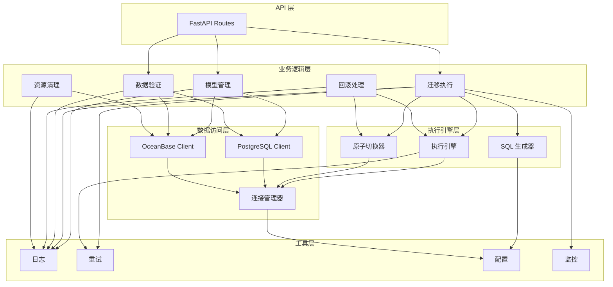

# OceanBase 增量迁移开发计划

## 1. 技术栈

### 1.1 核心技术栈

| 类别 | 技术选型 | 版本要求 | 用途说明 |
|------|---------|---------|---------|
| **编程语言** | Python | 3.9+ | 主要开发语言 |
| **Web 框架** | FastAPI | 0.100+ | 提供 REST API 接口 |
| **数据库驱动** | psycopg2-binary | 2.9+ | PostgreSQL 连接 |
| **数据库驱动** | PyMySQL | 1.1+ | OceanBase/MySQL 连接 |
| **ORM** | SQLAlchemy | 2.0+ | 数据库抽象层（可选） |
| **配置管理** | PyYAML | 6.0+ | YAML 配置文件解析 |
| **日志** | loguru | 0.7+ | 结构化日志记录 |
| **任务队列** | Celery | 5.3+ | 异步任务处理 |
| **消息代理** | Redis | 7.0+ | Celery 消息队列 |
| **数据验证** | Pydantic | 2.0+ | 数据模型验证 |
| **测试框架** | pytest | 7.4+ | 单元测试和集成测试 |
| **测试覆盖率** | pytest-cov | 4.1+ | 测试覆盖率统计 |
| **代码质量** | ruff | 0.1+ | 代码风格检查 |
| **代码格式化** | black | 23.0+ | 代码自动格式化 |
| **类型检查** | mypy | 1.5+ | 静态类型检查 |
| **进度显示** | tqdm | 4.66+ | 进度条显示 |
| **并发处理** | concurrent.futures | 内置 | 并发任务执行 |
| **重试机制** | tenacity | 8.2+ | 失败重试装饰器 |

### 1.2 数据库技术栈

| 类别 | 技术选型 | 版本要求 | 用途说明 |
|------|---------|---------|---------|
| **源数据库** | PostgreSQL | 13+ | GPF 发版环境 |
| **目标数据库** | OceanBase | 3.2+ | GPF 仿真环境 |
| **连接池** | psycopg2.pool | 内置 | PostgreSQL 连接池 |
| **连接池** | pymysql.ConnectionPool | 内置 | OceanBase 连接池 |

### 1.3 文档与工具

| 类别 | 技术选型 | 版本要求 | 用途说明 |
|------|---------|---------|---------|
| **文档生成** | MkDocs | 1.5+ | API 文档生成 |
| **流程图** | Mermaid | 内置 | 流程图绘制 |
| **版本控制** | Git | 2.40+ | 代码版本管理 |
| **容器化** | Docker | 24.0+ | 应用容器化部署 |
| **编排工具** | Docker Compose | 2.20+ | 多容器编排 |
| **环境管理** | venv | 内置 | Python 虚拟环境 |

### 1.4 可选技术栈

| 类别 | 技术选型 | 版本要求 | 用途说明 |
|------|---------|---------|---------|
| **监控** | Prometheus | 2.45+ | 系统监控指标采集 |
| **可视化** | Grafana | 10.0+ | 监控数据可视化 |
| **告警** | Alertmanager | 0.26+ | 告警规则管理 |
| **分布式追踪** | Jaeger | 1.50+ | 分布式链路追踪 |
| **API 文档** | Swagger/OpenAPI | 3.0+ | API 文档自动生成 |

---

## 2. 项目结构设计

### 2.1 目录结构

```
PostgresToOceanBase/
├── config/                          # 配置文件
│   ├── config.yaml                 # 主配置文件
│   ├── type_mapping.yaml           # 类型映射配置
│   └── incremental_config.yaml     # 增量迁移配置
├── src/
│   ├── api/                        # API 接口层
│   │   ├── __init__.py
│   │   ├── main.py                 # FastAPI 应用入口
│   │   ├── routes/
│   │   │   ├── __init__.py
│   │   │   ├── model.py            # 模型相关 API
│   │   │   ├── migration.py        # 迁移相关 API
│   │   │   └── validation.py       # 验证相关 API
│   │   └── schemas/                # Pydantic 数据模型
│   │       ├── __init__.py
│   │       ├── model.py            # 模型定义
│   │       ├── migration.py        # 迁移请求/响应
│   │       └── validation.py       # 验证结果
│   ├── database/                   # 数据库客户端
│   │   ├── __init__.py
│   │   ├── connection.py           # 连接管理器
│   │   ├── postgres.py             # PostgreSQL 客户端
│   │   └── oceanbase.py            # OceanBase 客户端
│   ├── model/                      # 模型管理模块
│   │   ├── __init__.py
│   │   ├── exporter.py             # 模型导出器
│   │   ├── parser.py               # 模型解析器
│   │   ├── query.py                # 模型查询器
│   │   └── comparator.py           # 模型比对引擎
│   ├── migration/                  # 迁换逻辑模块
│   │   ├── __init__.py
│   │   ├── schema.py               # 表结构迁移
│   │   ├── data.py                 # 数据迁移
│   │   ├── converter.py            # 类型转换器
│   │   ├── generator.py            # SQL 生成器
│   │   ├── executor.py             # 执行引擎
│   │   └── switcher.py             # 原子切换器
│   ├── validation/                 # 验证模块
│   │   ├── __init__.py
│   │   ├── data_validator.py       # 数据验证器
│   │   ├── schema_validator.py     # 结构验证器
│   │   └── report_generator.py     # 报告生成器
│   ├── rollback/                   # 回滚模块
│   │   ├── __init__.py
│   │   ├── handler.py              # 回滚处理器
│   │   └── restorer.py             # 状态恢复器
│   ├── cleanup/                    # 清理模块
│   │   ├── __init__.py
│   │   ├── temp_table_cleaner.py   # 临时表清理器
│   │   └── backup_cleaner.py       # 备份清理器
│   ├── monitor/                    # 监控模块
│   │   ├── __init__.py
│   │   ├── metrics.py              # 指标采集
│   │   ├── progress.py             # 进度追踪
│   │   └── alert.py                # 告警管理
│   ├── tasks/                      # 异步任务
│   │   ├── __init__.py
│   │   ├── celery_app.py           # Celery 应用
│   │   └── migration_task.py       # 迁移任务
│   ├── utils/                      # 工具模块
│   │   ├── __init__.py
│   │   ├── logger.py               # 日志工具
│   │   ├── retry.py                # 重试装饰器
│   │   ├── config.py               # 配置加载
│   │   └── common.py               # 通用工具函数
│   └── constants.py                # 常量定义
├── tests/                          # 测试目录
│   ├── __init__.py
│   ├── unit/                       # 单元测试
│   │   ├── test_model/
│   │   ├── test_migration/
│   │   ├── test_validation/
│   │   └── test_rollback/
│   ├── integration/                # 集成测试
│   │   ├── test_full_migration.py
│   │   └── test_incremental_migration.py
│   ├── fixtures/                   # 测试数据
│   │   ├── models/
│   │   └── migrations/
│   └── conftest.py                 # pytest 配置
├── docs/                           # 文档目录
│   ├── api.md                      # API 文档
│   ├── architecture.md             # 架构文档
│   ├── deployment.md               # 部署文档
│   └── troubleshooting.md          # 故障排查文档
├── scripts/                        # 脚本目录
│   ├── backup.sh                   # 备份脚本
│   ├── rollback.sh                 # 回滚脚本
│   └── cleanup.sh                  # 清理脚本
├── docker/                         # Docker 配置
│   ├── Dockerfile
│   └── docker-compose.yml
├── logs/                           # 日志目录
│   ├── migration.log
│   ├── api.log
│   └── error.log
├── backup/                         # 备份目录
│   ├── schema/
│   └── data/
├── .env.example                    # 环境变量示例
├── .gitignore
├── requirements.txt                # Python 依赖
├── requirements-dev.txt            # 开发依赖
├── pytest.ini                      # pytest 配置
├── pyproject.toml                  # 项目配置
└── README.md
```

### 2.2 核心模块依赖关系



---

## 3. 开发计划

### 3.1 总体时间规划

| 阶段 | 工期 | 工作日 | 里程碑 |
|------|------|--------|--------|
| **阶段 1：需求分析与设计** | 1 周 | 5 天 | 完成详细设计文档 |
| **阶段 2：基础框架搭建** | 1 周 | 5 天 | 完成项目结构和基础组件 |
| **阶段 3：模型管理模块** | 2 周 | 10 天 | 完成模型导出、解析、查询、比对 |
| **阶段 4：迁移执行模块** | 3 周 | 15 天 | 完成 SQL 生成、执行、切换 |
| **阶段 5：验证与回滚模块** | 2 周 | 10 天 | 完成数据验证、回滚处理 |
| **阶段 6：监控与清理模块** | 1 周 | 5 天 | 完成监控指标、资源清理 |
| **阶段 7：API 接口开发** | 1 周 | 5 天 | 完成 REST API 接口 |
| **阶段 8：测试与优化** | 2 周 | 10 天 | 完成单元测试、集成测试、性能优化 |
| **阶段 9：文档与部署** | 1 周 | 5 天 | 完成文档编写、部署脚本 |
| **总计** | **14 周** | **70 天** | **系统上线** |

### 3.2 详细开发计划

#### 阶段 1：需求分析与设计（第 1 周）

**目标**：完成详细设计文档，明确技术方案

| 任务 | 工作量 | 负责人 | 交付物 |
|------|--------|--------|--------|
| 需求调研与分析 | 1 天 | 架构师 | 需求规格说明书 |
| 技术方案设计 | 1 天 | 架构师 | 技术方案文档 |
| 数据库设计 | 1 天 | DBA | 数据库设计文档 |
| API 接口设计 | 1 天 | 后端开发 | API 接口文档 |
| 项目结构设计 | 1 天 | 后端开发 | 项目结构文档 |

**里程碑**：完成所有设计文档，通过评审

---

#### 阶段 2：基础框架搭建（第 2 周）

**目标**：完成项目结构和基础组件开发

| 任务 | 工作量 | 负责人 | 交付物 |
|------|--------|--------|--------|
| 创建项目目录结构 | 0.5 天 | 后端开发 | 项目骨架 |
| 配置开发环境 | 0.5 天 | 后端开发 | 开发环境配置 |
| 实现配置加载模块 | 1 天 | 后端开发 | `src/utils/config.py` |
| 实现日志模块 | 1 天 | 后端开发 | `src/utils/logger.py` |
| 实现重试装饰器 | 1 天 | 后端开发 | `src/utils/retry.py` |
| 实现连接管理器 | 1 天 | 后端开发 | `src/database/connection.py` |

**里程碑**：基础框架完成，可以连接数据库

---

#### 阶段 3：模型管理模块（第 3-4 周）

**目标**：完成模型导出、解析、查询、比对功能

**第 3 周：模型导出与解析**

| 任务 | 工作量 | 负责人 | 交付物 |
|------|--------|--------|--------|
| 设计模型数据结构 | 1 天 | 后端开发 | Pydantic 模型定义 |
| 实现模型导出器 | 2 天 | 后端开发 | `src/model/exporter.py` |
| 实现模型解析器 | 2 天 | 后端开发 | `src/model/parser.py` |

**第 4 周：模型查询与比对**

| 任务 | 工作量 | 负责人 | 交付物 |
|------|--------|--------|--------|
| 实现模型查询器 | 2 天 | 后端开发 | `src/model/query.py` |
| 实现模型比对引擎 | 3 天 | 后端开发 | `src/model/comparator.py` |

**里程碑**：可以导出模型并执行比对，生成差异报告

---

#### 阶段 4：迁移执行模块（第 5-7 周）

**目标**：完成 SQL 生成、执行、切换功能

**第 5 周：SQL 生成器**

| 任务 | 工作量 | 负责人 | 交付物 |
|------|--------|--------|--------|
| 设计 SQL 生成策略 | 1 天 | 后端开发 | SQL 生成设计文档 |
| 实现 DDL 语句生成器 | 2 天 | 后端开发 | `src/migration/generator.py` (DDL 部分) |
| 实现数据迁移 SQL 生成器 | 2 天 | 后端开发 | `src/migration/generator.py` (数据部分) |

**第 6 周：执行引擎**

| 任务 | 工作量 | 负责人 | 交付物 |
|------|--------|--------|--------|
| 设计执行引擎架构 | 1 天 | 后端开发 | 执行引擎设计文档 |
| 实现临时表创建执行器 | 2 天 | 后端开发 | `src/migration/executor.py` (创建部分) |
| 实现数据迁移执行器 | 2 天 | 后端开发 | `src/migration/executor.py` (迁移部分) |

**第 7 周：原子切换器**

| 任务 | 工作量 | 负责人 | 交付物 |
|------|--------|--------|--------|
| 设计原子切换方案 | 1 天 | 后端开发 | 原子切换设计文档 |
| 实现原子切换执行器 | 3 天 | 后端开发 | `src/migration/switcher.py` |
| 集成测试迁移流程 | 1 天 | 测试开发 | 集成测试用例 |

**里程碑**：可以执行完整的增量迁移流程

---

#### 阶段 5：验证与回滚模块（第 8-9 周）

**目标**：完成数据验证和回滚处理功能

**第 8 周：数据验证**

| 任务 | 工作量 | 负责人 | 交付物 |
|------|--------|--------|--------|
| 设计验证策略 | 1 天 | 后端开发 | 验证策略文档 |
| 实现数据验证器 | 2 天 | 后端开发 | `src/validation/data_validator.py` |
| 实现结构验证器 | 2 天 | 后端开发 | `src/validation/schema_validator.py` |

**第 9 周：回滚处理**

| 任务 | 工作量 | 负责人 | 交付物 |
|------|--------|--------|--------|
| 设计回滚策略 | 1 天 | 后端开发 | 回滚策略文档 |
| 实现回滚处理器 | 2 天 | 后端开发 | `src/rollback/handler.py` |
| 实现状态恢复器 | 2 天 | 后端开发 | `src/rollback/restorer.py` |

**里程碑**：可以验证迁移结果并执行回滚

---

#### 阶段 6：监控与清理模块（第 10 周）

**目标**：完成监控指标和资源清理功能

| 任务 | 工作量 | 负责人 | 交付物 |
|------|--------|--------|--------|
| 实现指标采集模块 | 1 天 | 后端开发 | `src/monitor/metrics.py` |
| 实现进度追踪模块 | 1 天 | 后端开发 | `src/monitor/progress.py` |
| 实现告警管理模块 | 1 天 | 后端开发 | `src/monitor/alert.py` |
| 实现临时表清理器 | 1 天 | 后端开发 | `src/cleanup/temp_table_cleaner.py` |
| 实现备份清理器 | 1 天 | 后端开发 | `src/cleanup/backup_cleaner.py` |

**里程碑**：可以监控迁移进度并自动清理资源

---

#### 阶段 7：API 接口开发（第 11 周）

**目标**：完成 REST API 接口开发

| 任务 | 工作量 | 负责人 | 交付物 |
|------|--------|--------|--------|
| 设计 API 接口规范 | 0.5 天 | 后端开发 | API 接口规范文档 |
| 实现 FastAPI 应用 | 0.5 天 | 后端开发 | `src/api/main.py` |
| 实现模型相关 API | 1 天 | 后端开发 | `src/api/routes/model.py` |
| 实现迁移相关 API | 1.5 天 | 后端开发 | `src/api/routes/migration.py` |
| 实现验证相关 API | 1 天 | 后端开发 | `src/api/routes/validation.py` |
| 实现 Pydantic 数据模型 | 0.5 天 | 后端开发 | `src/api/schemas/` |

**里程碑**：可以通过 API 调用所有功能

---

#### 阶段 8：测试与优化（第 12-13 周）

**目标**：完成测试和性能优化

**第 12 周：单元测试**

| 任务 | 工作量 | 负责人 | 交付物 |
|------|--------|--------|--------|
| 编写模型管理测试 | 2 天 | 测试开发 | `tests/unit/test_model/` |
| 编写迁移执行测试 | 2 天 | 测试开发 | `tests/unit/test_migration/` |
| 编写验证回滚测试 | 1 天 | 测试开发 | `tests/unit/test_validation/` |

**第 13 周：集成测试与优化**

| 任务 | 工作量 | 负责人 | 交付物 |
|------|--------|--------|--------|
| 编写集成测试 | 3 天 | 测试开发 | `tests/integration/` |
| 性能测试与优化 | 2 天 | 后端开发 | 性能测试报告 |

**里程碑**：测试覆盖率 > 80%，性能满足要求

---

#### 阶段 9：文档与部署（第 14 周）

**目标**：完成文档编写和部署脚本

| 任务 | 工作量 | 负责人 | 交付物 |
|------|--------|--------|--------|
| 编写 API 文档 | 1 天 | 技术文档 | `docs/api.md` |
| 编写部署文档 | 1 天 | 技术文档 | `docs/deployment.md` |
| 编写故障排查文档 | 1 天 | 技术文档 | `docs/troubleshooting.md` |
| 编写部署脚本 | 1 天 | 运维开发 | `scripts/` |
| 编写 Docker 配置 | 1 天 | 运维开发 | `docker/` |

**里程碑**：文档完整，可以一键部署

---

## 4. 里程碑与交付物

### 4.1 主要里程碑

| 里程碑 | 时间节点 | 交付物 | 验收标准 |
|--------|---------|--------|---------|
| **M1: 设计完成** | 第 1 周末 | 设计文档集 | 所有设计文档通过评审 |
| **M2: 基础框架完成** | 第 2 周末 | 项目骨架 | 可以连接数据库，日志正常 |
| **M3: 模型管理完成** | 第 4 周末 | 模型管理模块 | 可以导出模型并执行比对 |
| **M4: 迁移执行完成** | 第 7 周末 | 迁移执行模块 | 可以执行完整的增量迁移 |
| **M5: 验证回滚完成** | 第 9 周末 | 验证回滚模块 | 可以验证结果并执行回滚 |
| **M6: 监控清理完成** | 第 10 周末 | 监控清理模块 | 可以监控进度并清理资源 |
| **M7: API 接口完成** | 第 11 周末 | API 接口 | 所有功能可通过 API 调用 |
| **M8: 测试完成** | 第 13 周末 | 测试套件 | 测试覆盖率 > 80% |
| **M9: 系统上线** | 第 14 周末 | 完整系统 | 系统可部署运行 |

### 4.2 交付物清单

| 类别 | 交付物 | 格式 | 交付时间 |
|------|--------|------|---------|
| **文档** | 需求规格说明书 | Markdown | 第 1 周 |
| **文档** | 技术方案文档 | Markdown | 第 1 周 |
| **文档** | 数据库设计文档 | Markdown | 第 1 周 |
| **文档** | API 接口文档 | Markdown/OpenAPI | 第 11 周 |
| **文档** | 部署文档 | Markdown | 第 14 周 |
| **文档** | 故障排查文档 | Markdown | 第 14 周 |
| **代码** | 源代码 | Python | 持续交付 |
| **代码** | 单元测试 | Python | 第 12 周 |
| **代码** | 集成测试 | Python | 第 13 周 |
| **配置** | 配置文件 | YAML | 第 2 周 |
| **脚本** | 部署脚本 | Shell | 第 14 周 |
| **容器** | Docker 镜像 | Dockerfile | 第 14 周 |
| **报告** | 性能测试报告 | Markdown | 第 13 周 |
| **报告** | 测试覆盖率报告 | HTML | 第 13 周 |

---

## 5. 资源与团队

### 5.1 团队角色

| 角色 | 人数 | 职责 | 技能要求 |
|------|------|------|---------|
| **架构师** | 1 | 技术方案设计、架构评审 | Python、数据库架构、分布式系统 |
| **后端开发** | 2 | 核心功能开发、代码实现 | Python、FastAPI、数据库 |
| **DBA** | 1 | 数据库设计、性能优化 | PostgreSQL、OceanBase |
| **测试开发** | 1 | 测试用例编写、自动化测试 | pytest、测试框架 |
| **技术文档** | 1 | 文档编写、API 文档 | Markdown、技术写作 |
| **运维开发** | 1 | 部署脚本、容器化 | Docker、Shell、CI/CD |

### 5.2 开发环境

| 环境 | 用途 | 配置 |
|------|------|------|
| **开发环境** | 日常开发 | 4C8G，本地 Docker |
| **测试环境** | 功能测试 | 4C16G，独立服务器 |
| **仿真环境** | 集成测试 | 8C32G，独立服务器 |
| **生产环境** | 正式运行 | 16C64G，高可用集群 |

---

## 6. 风险管理

### 6.1 技术风险

| 风险项 | 可能性 | 影响 | 应对措施 |
|-------|--------|------|---------|
| 模型比对逻辑复杂 | 中 | 高 | 充分测试，参考成熟方案 |
| 原子切换失败 | 低 | 高 | 保留备份，快速回滚方案 |
| 性能不达标 | 中 | 中 | 提前性能测试，优化 SQL |
| 数据库兼容性问题 | 中 | 中 | 充分测试，建立兼容性矩阵 |

### 6.2 进度风险

| 风险项 | 可能性 | 影响 | 应对措施 |
|-------|--------|------|---------|
| 需求变更 | 中 | 高 | 需求冻结，变更评审流程 |
| 人员流动 | 低 | 高 | 知识共享，代码文档完善 |
| 测试不充分 | 中 | 高 | 提前测试，自动化测试 |
| 资源不足 | 低 | 中 | 提前规划，资源预留 |

### 6.3 质量风险

| 风险项 | 可能性 | 影响 | 应对措施 |
|-------|--------|------|---------|
| 代码质量问题 | 中 | 高 | 代码评审，静态检查 |
| 测试覆盖率不足 | 中 | 中 | 设定覆盖率目标，持续监控 |
| 文档不完整 | 中 | 中 | 文档与代码同步更新 |
| 部署失败 | 低 | 高 | 部署脚本测试，灰度发布 |

---

## 7. 质量保证

### 7.1 代码质量标准

| 指标 | 目标值 | 检查工具 |
|------|--------|---------|
| 代码风格符合规范 | 100% | ruff |
| 类型注解覆盖率 | > 90% | mypy |
| 测试覆盖率 | > 80% | pytest-cov |
| 代码重复率 | < 5% | pylint |
| 圈复杂度 | < 10 | pylint |

### 7.2 测试策略

| 测试类型 | 覆盖范围 | 执行频率 | 负责人 |
|---------|---------|---------|--------|
| 单元测试 | 所有函数和方法 | 每次提交 | 开发人员 |
| 集成测试 | 核心业务流程 | 每日构建 | 测试开发 |
| 性能测试 | 关键接口 | 每周 | 测试开发 |
| 压力测试 | 系统极限 | 上线前 | 测试开发 |
| 安全测试 | 安全漏洞 | 上线前 | 安全团队 |

### 7.3 代码评审流程

1. **提交 PR**：开发人员提交 Pull Request
2. **自动化检查**：CI/CD 自动运行测试和代码检查
3. **人工评审**：至少 1 人评审代码
4. **修改完善**：根据评审意见修改代码
5. **合并代码**：通过评审后合并到主分支

---

## 8. 部署与运维

### 8.1 部署策略

| 阶段 | 环境 | 部署方式 | 回滚策略 |
|------|------|---------|---------|
| 开发 | 开发环境 | 本地 Docker | 重新构建 |
| 测试 | 测试环境 | CI/CD 自动部署 | 回滚到上一个版本 |
| 预发布 | 仿真环境 | 手动部署 | 恢复数据库备份 |
| 生产 | 生产环境 | 灰度发布 | 快速回滚到旧版本 |

### 8.2 监控指标

| 类别 | 指标 | 阈值 | 告警级别 |
|------|------|------|---------|
| 系统资源 | CPU 使用率 | > 80% | 警告 |
| 系统资源 | 内存使用率 | > 85% | 警告 |
| 系统资源 | 磁盘使用率 | > 90% | 严重 |
| 应用性能 | API 响应时间 | > 5s | 警告 |
| 应用性能 | 错误率 | > 1% | 严重 |
| 数据库 | 连接数 | > 80% | 警告 |
| 数据库 | 慢查询数 | > 10/min | 警告 |

### 8.3 备份策略

| 备份类型 | 频率 | 保留时间 | 存储位置 |
|---------|------|---------|---------|
| 数据库全量备份 | 每天 | 7 天 | 本地 + 远程 |
| 配置文件备份 | 每次变更 | 30 天 | 版本控制 |
| 日志备份 | 每天 | 30 天 | 日志服务器 |

---

## 9. 后续优化方向

### 9.1 功能增强

- 支持实时增量数据同步（CDC）
- 支持在线迁移（不停机迁移）
- 支持多租户管理
- 支持自定义转换规则

### 9.2 性能优化

- 优化批量插入性能
- 实现并行迁移
- 优化 SQL 生成策略
- 实现增量缓存

### 9.3 用户体验

- 提供 Web 管理界面
- 支持迁移任务可视化
- 提供迁移进度实时推送
- 支持迁移历史查询

---

## 10. 总结

本开发计划基于 OceanBase 增量迁移方案，详细规划了 14 周的开发周期，涵盖了从需求分析到系统上线的完整流程。

**关键成功因素：**

1. **充分的需求分析和设计**：确保技术方案的可行性
2. **严格的代码质量控制**：保证系统稳定性
3. **完善的测试体系**：降低线上风险
4. **详细的文档**：便于后续维护和扩展
5. **有效的风险管理**：及时应对潜在问题

**预期成果：**

- 完整的增量迁移系统
- > 80% 的测试覆盖率
- 完善的文档和部署脚本
- 可扩展的架构设计

---

**文档版本：** v1.0
**最后更新：** 2026-01-19
**维护人员：** 数据库迁移团队