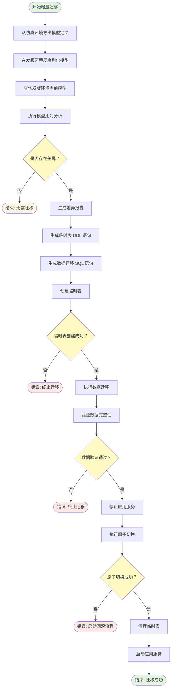
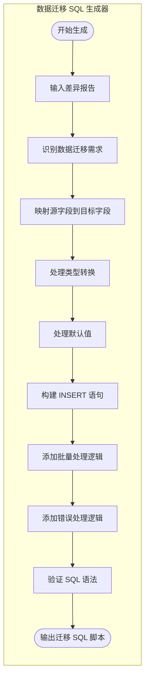

# OceanBase 数据库增量迁移方案

## 1. 方案概述

### 1.1 背景与目标

本方案针对已完成全量数据迁移的场景，提供表结构和索引的增量变更能力。当源端（GPF Java 应用发版环境）发生表结构变更时，能够安全、高效地将这些变更同步到目标端（GPF OceanBase 仿真环境），同时保证数据完整性和服务可用性。

**核心目标：**

- 支持表结构变更的增量同步（新增字段、修改字段类型、新增索引等）
- 确保数据迁移过程中的完整性和一致性
- 提供原子性切换机制，最小化服务中断时间
- 自动化差异分析和迁移流程，降低人工操作风险

### 1.2 适用场景

本方案适用于以下场景：

- **全量迁移已完成**：源端 PostgreSQL 数据已迁移至目标端 OceanBase
- **表结构变更同步**：需要同步新增字段、修改字段类型、新增索引等变更
- **停机迁移模式**：迁移期间应用停止写入，确保数据一致性
- **仿真环境验证**：在仿真环境验证变更后，再推广到生产环境

### 1.3 迁移范围

**包含：**

- 表结构变更（新增字段、修改字段类型、修改字段约束）
- 索引变更（新增索引、修改索引定义）
- 数据迁移（原表数据同步到新结构）

**不包含：**

- 存量数据全量迁移（已由全量迁移方案覆盖）
- 增量数据实时同步（需配合 CDC 工具）
- 应用代码变更（需配合发版流程）

---

## 2. 迁移架构

### 2.1 整体架构


### 2.2 核心组件职责

| 组件 | 职责 | 输入 | 输出 |
|------|------|------|------|
| 模型导出器 | 从仿真环境导出完整的模型定义 | OceanBase 实例 | JSON 模型文件 |
| 模型反序列化器 | 解析 JSON 模型定义 | JSON 文件 | 内存模型对象 |
| 环境模型查询器 | 查询发版环境中的当前模型 | PostgreSQL 实例 | 当前模型对象 |
| 模型比对引擎 | 比对目标模型与当前模型的差异 | 目标模型、当前模型 | 差异对象 |
| 差异报告生成器 | 生成结构化的差异报告 | 差异对象 | 报告文档 |
| DDL 语句生成器 | 根据差异生成临时表 DDL | 差异报告 | DDL 脚本 |
| 数据迁移 SQL 生成器 | 生成数据迁移 SQL | 差异报告 | 迁移 SQL 脚本 |
| 临时表创建执行器 | 执行临时表创建 DDL | DDL 脚本 | 执行结果 |
| 数据迁移执行器 | 执行数据迁移 SQL | 迁移 SQL 脚本 | 迁移结果 |
| 数据验证引擎 | 验证数据完整性和一致性 | 源表、目标表 | 验证报告 |
| 原子切换执行器 | 执行表重命名原子操作 | 原表、临时表 | 切换结果 |
| 临时表清理器 | 清理临时表和相关资源 | 临时表信息 | 清理结果 |

---

## 3. 迁移流程

### 3.1 整体流程



### 3.2 详述各阶段流程

#### 3.2.1 模型获取阶段


#### 3.2.2 模型比对阶段


#### 3.2.3 迁移脚本生成阶段


#### 3.2.4 迁移执行阶段


---

## 4. 核心组件实现逻辑

### 4.1 模型比对引擎


**比对策略：**

- **表级比对**：识别新增、修改、删除的表
- **字段级比对**：识别新增、修改、删除的字段
- **索引级比对**：识别新增、修改、删除的索引
- **约束级比对**：识别主键、外键、唯一约束的变化

### 4.2 DDL 语句生成器


**生成规则：**

- 临时表命名规则：`{原表名}_tmp_{时间戳}`
- 字段映射：保持原字段名和类型
- 索引映射：同步所有索引定义
- 约束映射：保留主键和唯一约束

### 4.3 数据迁移 SQL 生成器



**迁移策略：**

- 字段映射：源表字段对应到临时表字段
- 类型转换：处理数据类型差异
- 默认值处理：为新增字段设置默认值
- 批量处理：支持批量插入优化性能

### 4.4 数据验证引擎

```mermaid
flowchart TD
    subgraph "数据验证引擎"
        Start([开始验证]) --> Input[输入源表和目标表]
        Input --> Count1[统计源表记录数]
        Input --> Count2[统计目标表记录数]
        Count1 --> CompareCount[比对记录数]
        Count2 --> CompareCount
        CompareCount --> {记录数一致？}
        {记录数一致？} -->|否| Output1([验证失败])
        {记录数一致？} -->|是| Sample[抽取样本数据]
        Sample --> CompareFields[比对字段值]
        CompareFields --> {字段值一致？}
        {字段值一致？} -->|否| Output2([验证失败])
        {字段值一致？} -->|是| CheckConstraints[验证约束完整性]
        CheckConstraints --> {约束验证通过？}
        {约束验证通过？} -->|否| Output3([验证失败])
        {约束验证通过？} -->|是| Output4([验证通过])
    end
```

**验证维度：**

- **记录数验证**：确保源表和目标表记录数一致
- **字段值验证**：抽样比对关键字段值
- **约束验证**：确保主键、唯一约束完整
- **数据完整性**：验证外键关系（如存在）

### 4.5 原子切换执行器

```mermaid
flowchart LR
    subgraph "原子切换执行器"
        Start([开始切换]) --> Check1[检查应用服务状态]
        Check1 --> {服务已停止？}
        {服务已停止？} -->|否| Wait1[等待服务停止]
        {服务已停止？} -->|是| Backup[备份原表]
        Backup --> Rename1[重命名原表为备份表]
        Rename1 --> Rename2[重命名临时表为原表]
        Rename2 --> Check2[验证表结构]
        Check2 --> {结构正确？}
        {结构正确？} -->|否| Rollback[执行回滚操作]
        {结构正确？} -->|是| Check3[验证数据访问]
        Check3 --> {访问正常？}
        {访问正常？} -->|否| Rollback
        {访问正常？} -->|是| Output([切换成功])
    end
```

**切换策略：**

- **原子性**：使用事务确保操作的原子性
- **可回滚**：保留原表备份，支持快速回滚
- **最小化停机**：切换操作在秒级完成
- **验证机制**：切换后验证表结构和数据访问

### 4.6 临时表清理器

```mermaid
flowchart LR
    subgraph "临时表清理器"
        Start([开始清理]) --> Check1[检查临时表状态]
        Check1 --> {临时表存在？}
        {临时表存在？} -->|否| Output([清理完成])
        {临时表存在？} -->|是| Check2[检查应用运行状态]
        Check2 --> {应用正常运行？}
        {应用正常运行？} -->|否| Wait1[等待应用稳定]
        {应用正常运行？} -->|是| Backup[备份临时表数据]
        Backup --> Drop[删除临时表]
        Drop --> Verify[验证删除结果]
        Verify --> {删除成功？}
        {删除成功？} -->|否| Retry[重试删除操作]
        {删除成功？} -->|是| Log[记录清理日志]
        Log --> Output
    end
```

**清理策略：**

- **安全检查**：确保应用正常运行后再清理
- **备份机制**：清理前备份临时表数据
- **重试机制**：删除失败时自动重试
- **日志记录**：记录清理操作详情

---

## 5. 异常处理与回滚

### 5.1 异常分类

| 异常类型 | 触发场景 | 处理策略 |
|---------|---------|---------|
| 连接异常 | 无法连接数据库 | 重试 3 次，失败后终止 |
| DDL 执行异常 | 临时表创建失败 | 记录错误，终止迁移 |
| 数据迁移异常 | 数据插入失败 | 记录失败记录，继续执行 |
| 验证失败 | 数据不一致 | 终止迁移，保留临时表 |
| 切换失败 | 原子操作失败 | 执行回滚，恢复原表 |
| 应用异常 | 应用无法启动 | 回滚切换，恢复原表 |

### 5.2 回滚流程

```mermaid
flowchart TD
    Start([检测到异常]) --> Identify[识别异常类型]
    Identify --> Classify[分类异常严重程度]
    Classify --> {严重程度？}
    {严重程度？} -->|严重| Stop1[立即停止迁移]
    {严重程度？} -->|可恢复| Log1[记录异常信息]
    Stop1 --> Backup1[备份当前状态]
    Log1 --> Backup1
    Backup1 --> Check1[检查是否已执行切换]
    Check1 --> {已切换？}
    {已切换？} -->|是| Rollback1[执行切换回滚]
    {已切换？} -->|否| Check2[检查临时表状态]
    Rollback1 --> Restore[恢复原表]
    Check2 --> {临时表存在？}
    {临时表存在？} -->|是| Clean1[清理临时表]
    {临时表存在？} -->|否| Notify[通知运维人员]
    Clean1 --> Notify
    Restore --> Notify
    Notify --> Report[生成异常报告]
    Report --> End([回滚完成])
```

**回滚策略：**

- **快速回滚**：切换失败时立即回滚到原表
- **状态保留**：保留临时表用于问题分析
- **日志记录**：详细记录异常和回滚过程
- **通知机制**：及时通知相关人员

---

## 6. 监控与报告

### 6.1 监控指标

| 指标类别 | 具体指标 | 阈值 |
|---------|---------|------|
| 执行进度 | 已处理表数 / 总表数 | 实时显示 |
| 数据迁移 | 已迁移记录数 / 总记录数 | 实时显示 |
| 执行时间 | 各阶段耗时 | < 30 分钟 |
| 资源使用 | CPU、内存、磁盘 I/O | < 80% |
| 错误率 | 失败操作数 / 总操作数 | < 1% |

### 6.2 报告内容


**报告包含：**

- **执行摘要**：迁移开始时间、结束时间、总耗时、状态
- **差异分析**：新增、修改、删除的表、字段、索引
- **数据验证**：记录数比对、抽样验证结果
- **性能指标**：各阶段耗时、资源使用情况
- **异常记录**：异常类型、发生时间、处理结果
- **建议操作**：后续需要执行的运维操作

---

## 7. 安全与保障

### 7.1 数据安全

- **备份机制**：迁移前备份原表数据
- **事务保护**：关键操作使用事务保证原子性
- **权限控制**：使用最小权限原则执行迁移
- **审计日志**：记录所有操作用于审计

### 7.2 服务可用性

- **停机窗口**：提前规划停机时间，最小化影响
- **快速切换**：原子切换操作在秒级完成
- **快速回滚**：异常时支持快速回滚到原状态
- **健康检查**：切换后执行健康检查确保服务正常

### 7.3 数据完整性

- **多维度验证**：记录数、字段值、约束完整性验证
- **抽样检查**：对关键数据进行抽样比对
- **一致性校验**：确保迁移前后数据一致
- **异常处理**：验证失败时终止迁移并保留数据

---

## 8. 迁移检查清单

### 8.1 迁移前准备

- [ ] 确认全量迁移已完成
- [ ] 备份源端和目标端数据库
- [ ] 验证仿真环境模型定义完整性
- [ ] 确认应用发版计划和时间窗口
- [ ] 准备迁移执行环境
- [ ] 配置监控和告警机制
- [ ] 准备回滚方案和应急预案

### 8.2 迁移中执行

- [ ] 导出仿真环境模型定义
- [ ] 执行模型比对分析
- [ ] 生成差异报告并审核
- [ ] 生成迁移脚本并验证
- [ ] 创建临时表
- [ ] 执行数据迁移
- [ ] 验证数据完整性
- [ ] 停止应用服务
- [ ] 执行原子切换
- [ ] 启动应用服务
- [ ] 执行健康检查

### 8.3 迁移后验证

- [ ] 验证应用功能正常
- [ ] 验证数据访问正常
- [ ] 验证性能指标正常
- [ ] 清理临时表和备份
- [ ] 生成迁移报告
- [ ] 归档迁移日志
- [ ] 更新文档和配置

---

## 9. 风险与应对

### 9.1 主要风险

| 风险项 | 风险等级 | 影响 | 应对措施 |
|-------|---------|------|---------|
| 数据丢失 | 高 | 业务中断 | 迁移前备份，验证失败不切换 |
| 切换失败 | 高 | 服务不可用 | 保留原表备份，快速回滚 |
| 数据不一致 | 中 | 业务异常 | 多维度验证，验证失败终止 |
| 性能影响 | 中 | 用户体验下降 | 批量处理，优化 SQL |
| 应用不兼容 | 中 | 功能异常 | 仿真环境充分测试 |

### 9.2 应急预案

**场景 1：数据迁移失败**

- 立即停止迁移操作
- 保留临时表用于问题分析
- 检查失败原因并修复
- 重新执行迁移或回滚到原表

**场景 2：原子切换失败**

- 立即执行回滚操作
- 恢复原表为活动表
- 检查切换失败原因
- 修复后重新执行切换

**场景 3：应用启动失败**

- 立即执行回滚操作
- 恢复到迁移前状态
- 检查应用兼容性问题
- 修复后重新执行迁移

---

## 10. 最佳实践

### 10.1 迁移前

- **充分测试**：在仿真环境充分测试迁移流程
- **备份优先**：确保有完整的备份和恢复方案
- **计划周密**：制定详细的迁移计划和应急预案
- **团队协作**：明确各角色职责和沟通机制

### 10.2 迁移中

- **监控实时**：实时监控迁移进度和系统状态
- **快速响应**：异常发生时快速响应和处理
- **记录详细**：详细记录每个操作和结果
- **沟通及时**：及时向相关人员通报进展

### 10.3 迁移后

- **验证全面**：全面验证应用功能和数据完整性
- **文档更新**：及时更新相关文档和配置
- **经验总结**：总结经验教训，优化流程
- **持续监控**：持续监控系统运行状态

---

## 11. 附录

### 11.1 术语表

| 术语 | 定义 |
|------|------|
| 增量迁移 | 在已有数据基础上，仅迁移变更部分 |
| 原子切换 | 不可分割的表切换操作，要么全部成功，要么全部失败 |
| 临时表 | 迁移过程中创建的临时存储表 |
| 模型比对 | 比较两个模型定义的差异 |
| 差异报告 | 记录模型差异的详细报告 |
| DDL | 数据定义语言，用于定义数据库结构 |
| 回滚 | 恢复到迁移前的状态 |

### 11.2 参考文档

- 全量迁移方案文档
- OceanBase 数据库操作手册
- PostgreSQL 数据库操作手册
- 应用发版流程文档
- 运维应急响应手册

---

**文档版本：** v1.0
**最后更新：** 2026-01-19
**维护人员：** 数据库迁移团队